# Cyclic

This project was to model individual parts, and using standard bolts, fasteners, washers and spacers to create an epicylic gear train, with a sun gear in the center with plantery gears around it, which are held in place by the main body

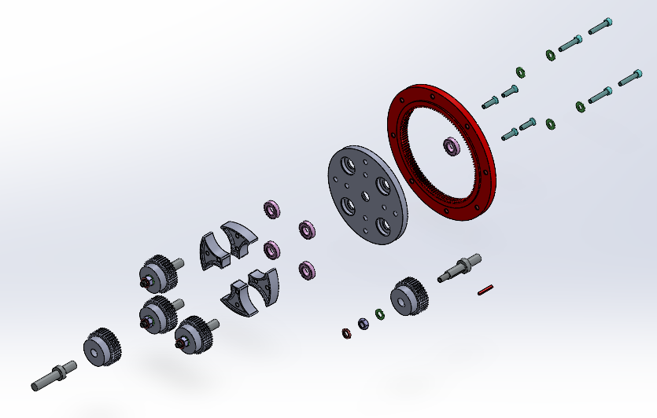
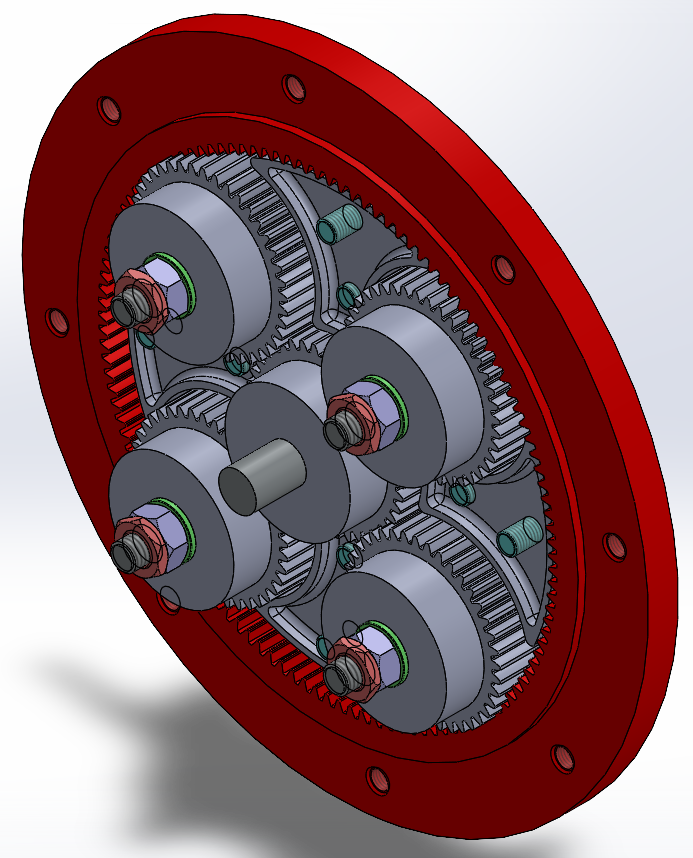

The main board that coats the whole gear train (in red) is fixed in place, whilst everything else is mated in position, therefore the structure can be used for simulation purposes. The gear trains can freely spin in place, and affect the other planetary gears

<table>
<tr>
<td>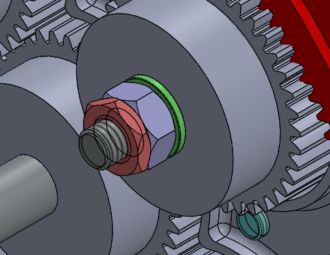</td>
<td>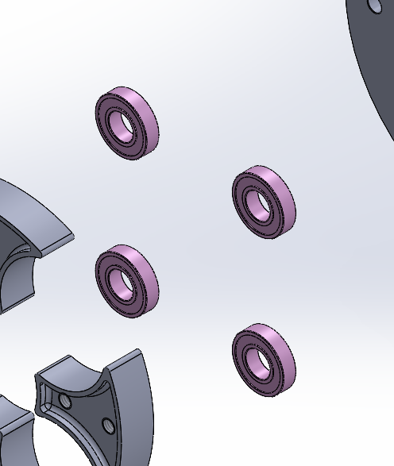</td>
</tr>
</table>

Looking closer, the standard bolts and washers can be seen, to fasten each planetary gear in place. The threads are designed for easier fits, whilst retaining enough tolerance for an easy assembly

Bearings are put into place to increase efficiency, via reduction of frictional force and also reducing wear and strain on each plantery gear

<table>
<tr>
<td>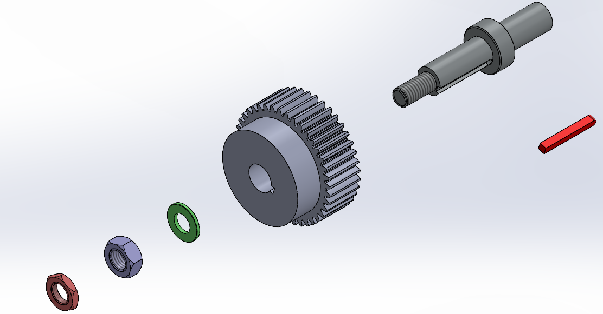 <b>Anti-Rotation Key</b></td>
<td>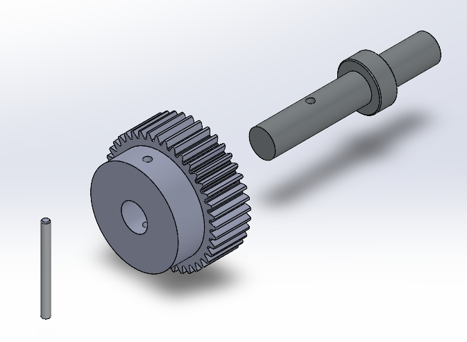 <b>Dowel Pin</b></td>
<td>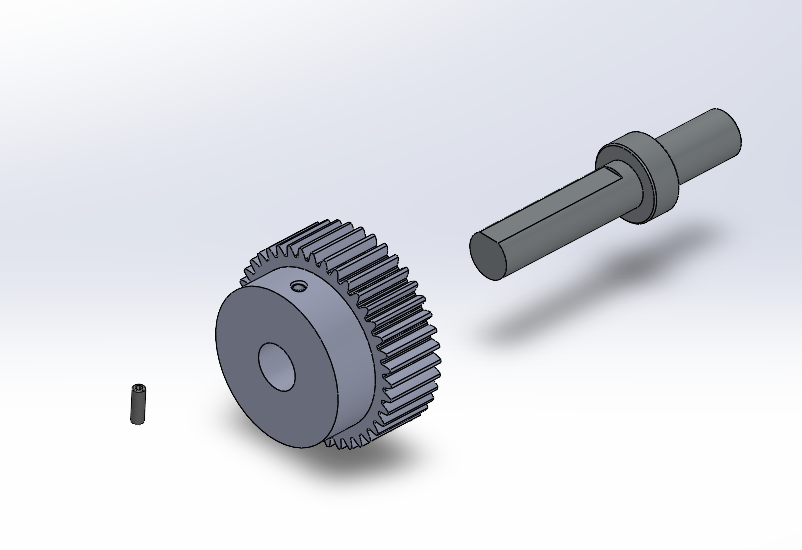 <b>Grub Screw</b></td>
</tr>
</table>

Anti rotation key setup shows 1 of 3 methods designed to initiate rotation from the spur gear to the shaft hub  
Grub screw relies on pure frictional force by driving the screw through the threads and making it contact with the shaft hub  
Dowel pin acts like a wedge between the shaft hub and the gear, causing the gear to sping with the shaft hub

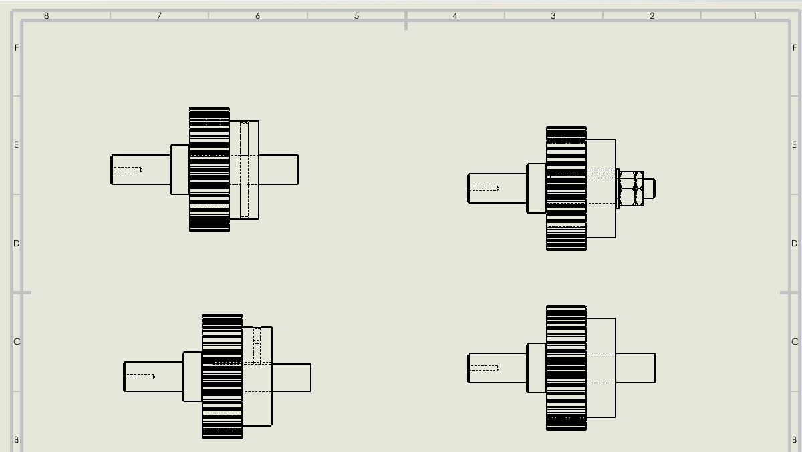

I have also designed drawings for easier understanding about how each shaft hub is connected to the plantery gear. There sketch highlights interior parts that are hidden from view for easier understanding without obstructing clarity

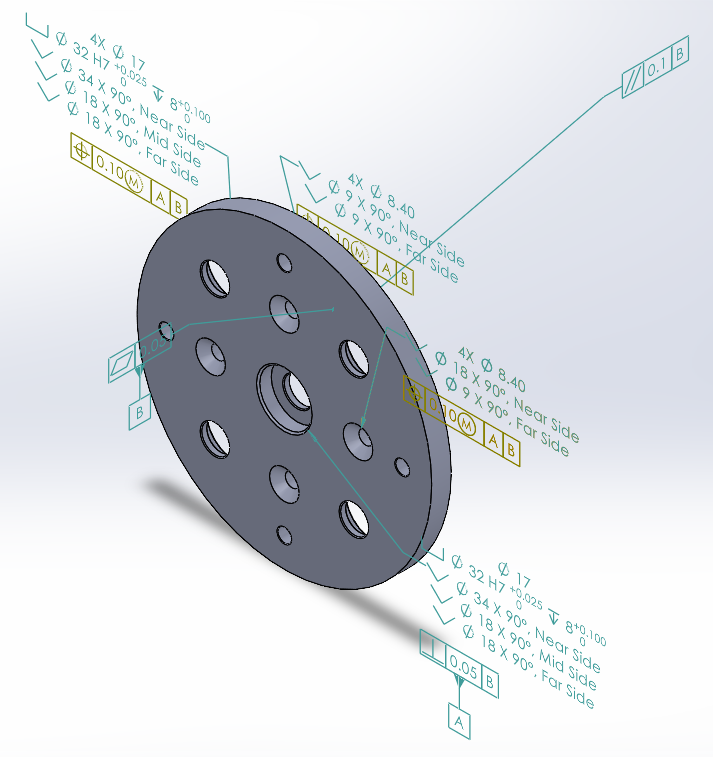

Some of the parts designed were given MBD, which is a tolerance measurement for manufacturing purposes, for example the counterbore sink contains tolerance dimensions about depth and angle given before a tapped hole is introduced  
The drills used would all be standard, and manufactures would not need to get specialized drills, hence reducing the price of said product

<table>
<tr>
<td>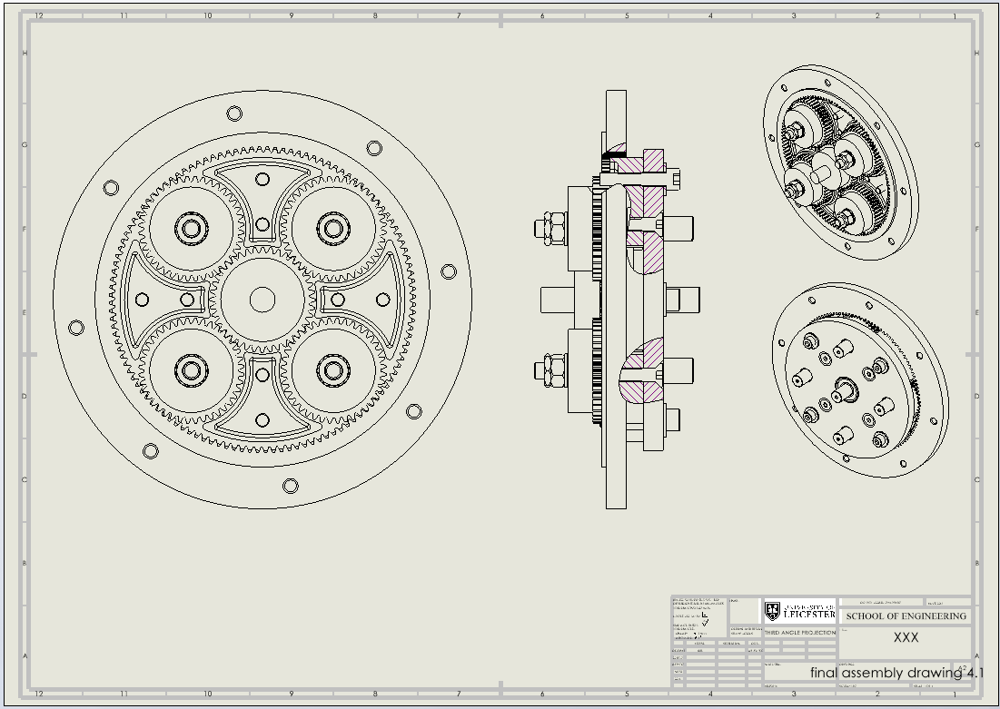 <b>Gear train drawing</b></td>
<td>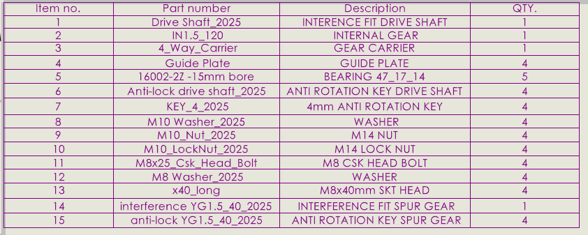 <b>Parts table</b></td>
<td>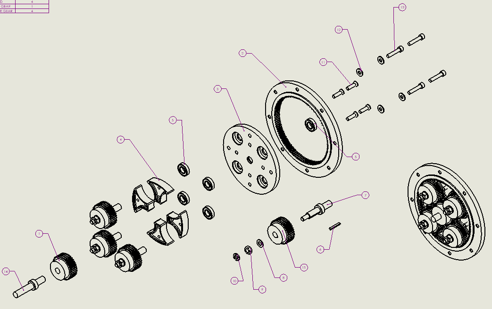 <b>Exploded drawing</b></td>
</tr>
</table>

I also designed a drawing containing an assembled gear train and an exploded view of the gear train. The exploded view has its parts labelled with balloon tags, and a table is provided to show the amount of pieces necessary to build the whole gear train  
Often assembly can be difficult to follow from schematics, but the assembled drawing is cut in half to show the organisation of the fasteners, nuts and screws in place in order. The whole exploded view is exploded part by part in chronological order, so the idea is to just push it back together and it would simply arrange it self. This would help designers following my schematics find it easier to design and assemble this product
