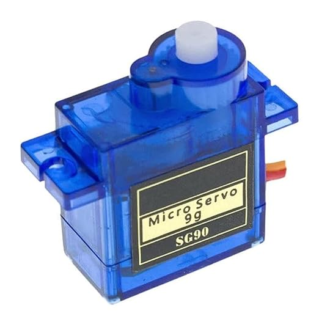
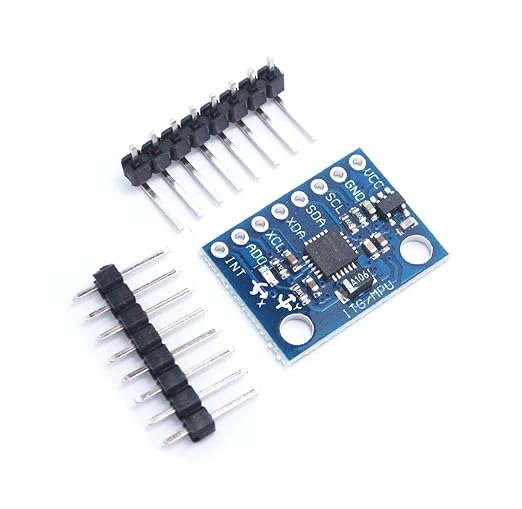

# Stabilizer

During my A-levels, I took design engineering as one of my subjects. During second year of my study, I was to make a product that would benefit my end user  
My chosen end user had a hobby of photography, so I undertook the project of making him a stabilizer to counteract camera shake from natural vibrations produced by his hand  

The idea was to use the mpu 6050 to detect changes in movement in 3 dimensions but also detect rotational forces acting upon the body  
Using outsourced code that was designed for the mpu 6050, provided by the manufacturers and modded by open source designers, I changed a small part of the code to allowed me to pass some logic through the arduino and to check for changes  
The logic was to use an interrupt based system to find changes in degree of movement in a single axis, then compare this info to the last stored value. Using the difference, it allowed me to apply the change of degree required to recorrect the unintended movement provided to the stabilizer  
The servo then took action to change the plate that would hold a phone / camera, and maintain stability  

Whilst the main product was focused on this simple idea, there was a lot more to consider during the project. One being use of time and time management and a demonstration of how much time was spent on each section of the project, to do this, I made use of a gaant chart to record time spent across the main and parts of the project of great significance  

Project lifestyle management was considered during this project, to see if components and the designed product was recyclable and its environmental impact. Whilst this project was still small scale, it is still important to have considerations in place if my product were to be mass produced  

The overall project took about 2/3 of the second year to complete, we were asked to make a presentation and upload it to a portal. I would upload it, but unfortunately my school made a shift towards microsoft teams from google classroom, and as of current our logins for our school for classroom do not work, therefore I do not have access to my work as of current. My fusion liscence has also expired that was granted by my school, so I cannot showcase my CAD models nor my eletronics with arduino
